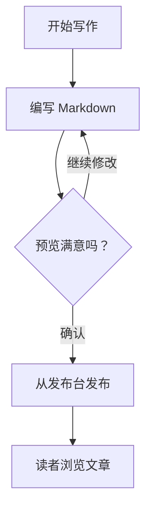
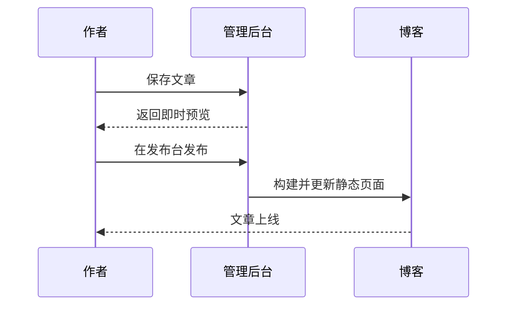

# Mermaid 写作与验收

博客文章和后台即时预览支持 Mermaid 图表，资源由本站提供，包含图表时才加载。

公开页面支持主题切换和站内导航；渲染失败时保留源码。后台预览保持无脚本沙箱隔离。图表较宽时可以横向滚动。

将下面的章节插入现有《Markdown 写作示例》文章的代码块章节后，保存并从后台发布台发布。不要用本地整篇文章覆盖线上正文。

## Mermaid 图表

将代码块的语言标记为 `mermaid`，就能用文本绘制图表。文章和后台即时预览都会渲染，并跟随深浅主题切换。语法错误时保留源码，方便检查。

### 流程图

写法：

````markdown

````

效果：


### 时序图

写法：

````markdown

````

效果：


